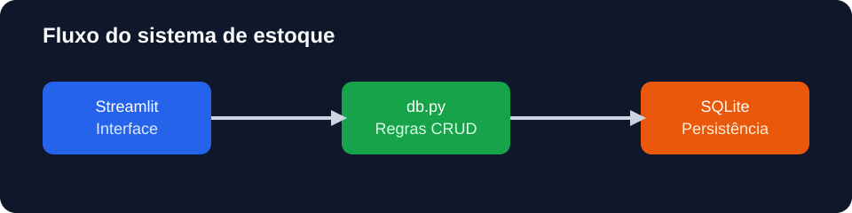

# Sistema de estoque CRUD

Aplicação web para cadastrar, consultar, buscar, atualizar e excluir produtos
de um estoque local. O projeto pratica persistência com SQLite e uma interface
operacional construída com Streamlit.

## Problema

Uma pequena operação precisa acompanhar produtos, preços e níveis de estoque
sem depender de uma planilha manual. Este projeto oferece um fluxo simples para
manter esses dados e alertar quando um item atinge o estoque mínimo.

## Funcionalidades

- cadastro de produto, categoria, preço e estoque;
- definição de estoque mínimo;
- listagem ordenada por nome;
- busca parcial por nome;
- atualização de estoque;
- atualização de preço;
- exclusão de produto;
- alerta de itens no estoque mínimo;
- persistência local em SQLite;
- validação de preço e campos obrigatórios;
- teste automatizado do ciclo CRUD.

## Tecnologias

- Python 3.11+
- SQLite
- Streamlit
- Pandas
- Pytest

## Como executar

```bash
python -m venv .venv
.\.venv\Scripts\activate
pip install -r requirements.txt
streamlit run app.py
```

O banco `estoque.db` é criado automaticamente na primeira execução. Depois,
abra `http://localhost:8501`.

## Como executar os testes

```bash
pytest -q
```

## Estrutura

```text
app.py                 # interface Streamlit
db.py                  # conexão, schema e operações CRUD
tests/test_db.py       # teste do ciclo de persistência
docs/images/           # diagrama do fluxo da aplicação
```

## Exemplo de uso

1. Cadastre um produto informando nome, categoria, preço e quantidade.
2. Pesquise pelo nome para localizar um item específico.
3. Atualize estoque ou preço usando o produto selecionado.
4. Observe o alerta quando o estoque ficar igual ou abaixo do mínimo.



## Cuidados de implementação

As consultas usam parâmetros do SQLite, evitando concatenar valores informados
pelo usuário diretamente no SQL. A camada de banco fica separada da interface,
o que permite testar as regras sem iniciar o Streamlit.

## Status

Projeto em organização para repositório independente, deploy e publicação no
LinkedIn.
